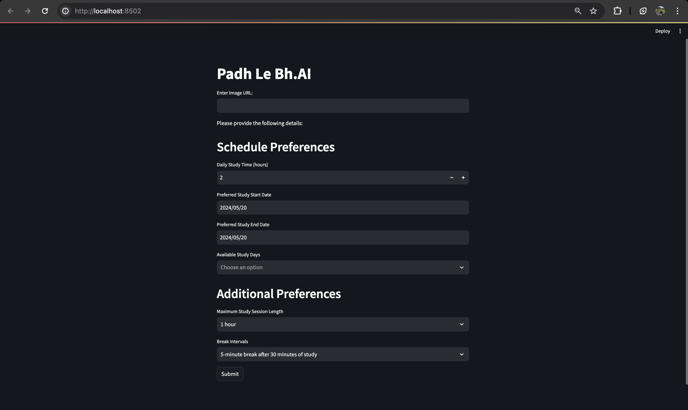
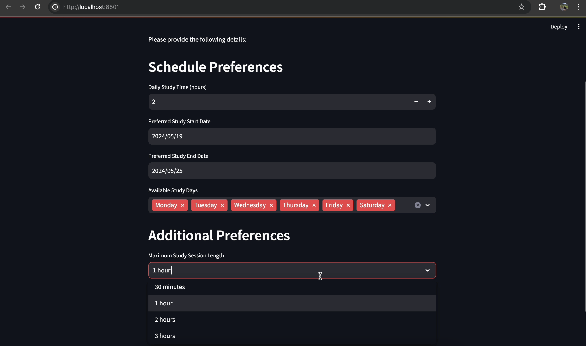

# PadhLeBh.AI-v1


"PadhLeBh.AI" is an AI-powered study planner created using OpenAI's GPT-4o API. It's the v1 of this tool which was developed for a hackathon and successfully won the competition. The application allows users to upload an image of their syllabus and specify their study preferences to generate a personalized study schedule.

## Features

- Upload your syllabus image via URL provided.
- Input study preferences including daily study time, study start and end dates, and available study days in the week.
- Customize additional preferences like maximum study session length and break intervals.
- Generates a tailored study schedule in a tabular format.

This tool is very helpful for the last month preparation of the examinations.

It is created using OpenAI API of the GPT-4 omni Model and the UI is created using Streamlit Library.


## Installation

1. Clone the repository

```bash
git clone https://github.com/adityauyadav/PadhLeBhAI-v1.git
cd PadhLeBhAI-v1
```

2. Install the required packages :
```bash
pip install -r requirements.txt
```

3. Add your API Key in the code :
```bash
client = OpenAI(api_key="addYourAPIKEY here")
```


## Run Locally

```bash
  streamlit run PadhLeBhAI-v1
```


## Contributing

Contributions are always welcome!
Please feel free to submit a Pull Request or you can contact me if you have any idea/suggestions/issues related to this project.

- Email: adityauyadav7@gmail.com
- Twitter: https://www.x.com/adityauyadav
- LinkedIN: https://www.linkedin.com/in/adityauyadav
 


## Screenshots



